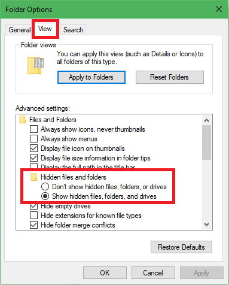
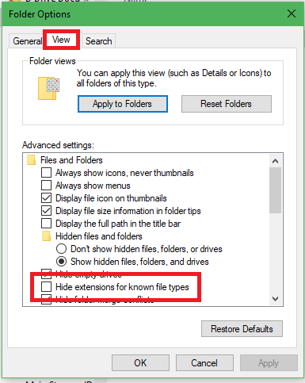
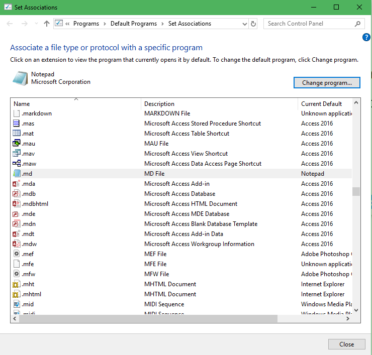

# How To Do Stuff in Windows 10
This is a running list of stuff I occasionally need to do/know but not often enough that it's made it to my long term memory.

## Show Hidden Files in Windows Explorer
If you need to see files that are normally hidden, like the .git directory, here's how:

1. Open a File Explorer window
1. Click on "File", then on "Options"
1. Go to the "View" tab, scroll down to "Hidden files and folders", then click the radio button for "Show hidden files, folders, and drives"

## Show .gitnore Filename (or: Show All File Extensions)

1. Open a File Explorer window
1. Click on "File", then "Options"
1. Go to the "View" tab, scroll down and uncheck "Hide extensions for known file types"

## Change The Default Program That Opens A File By File Extension

1. Click on Start button, then type "Run"
1. In the Run prompt, type "control /name Microsoft.DefaultPrograms /page pageFileAssoc"
1. Scroll to the file extension whose default program you want to change. Select it, then click "Change Program" at the top of the window

